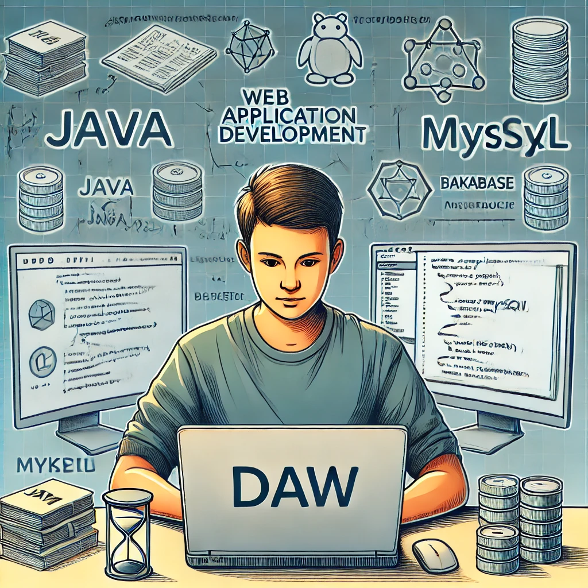

<h1 align="center">Hola 👋 , Me llamo Daniel Lizarazo</h1>
<h2 align="center">Soy estudiante de DAW</h2>

<h1 align="center">Proyecto de Desarrollo de Aplicaciones Web (DAW)

<h3 align="left">Idiomas y Herramientas:</h3>

     

### Descripción
Este repositorio está dedicado a mi proceso de aprendizaje en el desarrollo de aplicaciones web, con especialización en el backend. Actualmente, me enfoco en tecnologías como **Java** y **MySQL** para construir soluciones robustas y eficientes.

### Tecnologías
- **Java**: Para el desarrollo de la lógica de negocio y el backend de las aplicaciones.
- **MySQL**: Base de datos relacional para almacenar y gestionar datos de manera eficaz.
- **Backend**: Enfoque en el diseño, arquitectura y optimización de la parte del servidor.

---

### Objetivos
1. Mejorar mis habilidades en **programación backend**.
2. Profundizar en el uso de **Java** para el desarrollo empresarial.
3. Adquirir experiencia práctica en **bases de datos** con **MySQL**.

  

  

- 🔭 Estoy Aprendiendo **JAVA, html, CSS, MySQL;**

¡Gracias por visitar mi repositorio!
